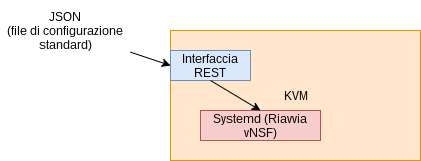
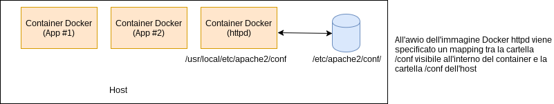
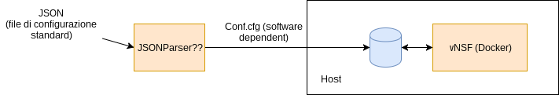

# SHIELD THESIS
## Design Aspects

---
## Implementazione vNSF
### KVM vs Docker
---
### Approccio KVM
Virtualizzazione dell'intero sistema operativo. 
- PRO
 - Maggior Isolamento
 - General-purpose (più flessibilità)
- CONTRO 
 - Lento
 - Dipendente da architettura sottostante
 
--- 
### Approccio Docker 
- PRO
 - Veloce
 - Leggero (facile migrazione di immagini)
- CONTRO
 - Minor Isolamento
 - Sicurezza (namespaces, root capabilities e shared kernel)
 
---
### Configurazione di una vNSF con KVM
 - Espone un'interfaccia REST
 - Riceve configurazione in formato character-oriented (es JSON)
 - Crea un file di configurazione readable dal Software
 - Rilancia il processo della vNSF (la macchina virtuale non è riavviata)

---
### Configurazione di una vNSF con KVM (2)

---
### Configurazione di una vNSF con Docker
Ogni container parte da una immagine _STATICA_ 
 - Come incorporare un file di configurazione in una vNSF su Docker?
 
Due soluzioni:
 - File di Configurazione incapsulato nell'immagine (Dockerfile) 
 - Volume Docker

---
### Dockerfile con configurazione vNSF
Dockerfile:

<code>FROM trustedDockerImage:latest</code>

<code>COPY vNSF.cfg /usr/local/etc/conf/vNSF.cfg</code>

Build:
<code>docker build -t localDockerImage .</code>

Run:
<code>docker run localDockerImage</code>

---
### Volumi Docker

 
Supponendo che il file di configurazione sia localmente disponibile: 

Run:
<code>docker run -v /etc/apache2/conf/:/usr/local/etc/apache2/conf trustedDockerImage:latest</code>

---
### Cambio di configurazione in Docker
- Nell'ambiente Docker non è possibile rilanciare un processo all'interno dello stesso container
 - Procedura:
  - Spegnimento del container attuale
  - Copia della configurazione con Dockerfile (o con mapping Volume)
  - Rilancio di un nuovo container
  
---
### Cambio Configurazione in Docker (2)

 
---
- E' necessario implementare una funzione che traduca una eventuale rappresentazione character-oriented in un file di configurazione specifico per la vNSF che si vuole utilizzare

--- 

  

